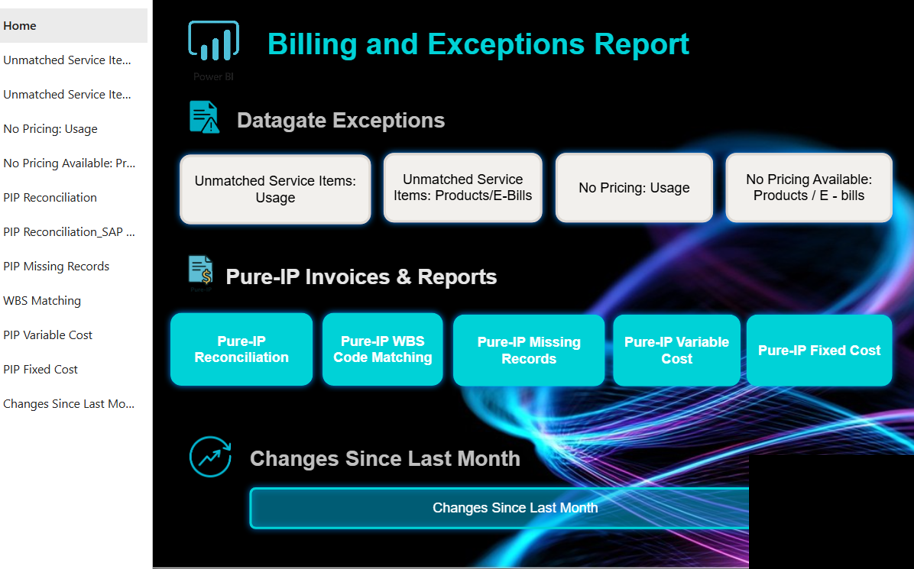
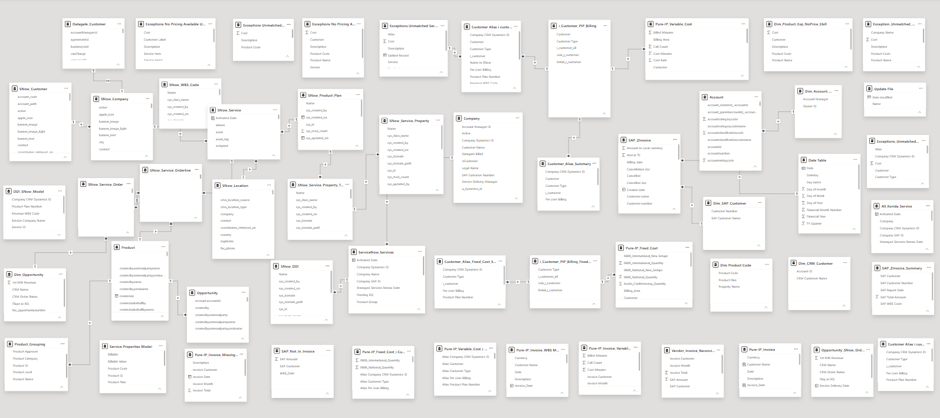
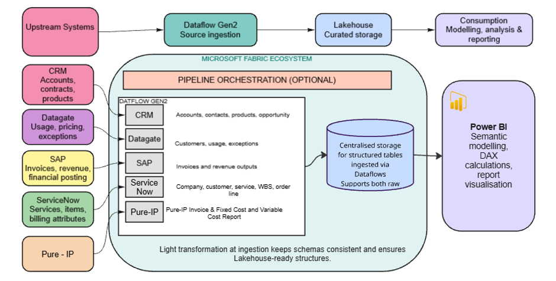

# Billing Exception Reporting Architecture

Portfolio project based on a large telecom-style reporting environment, focused on improving billing and exception reporting through clearer architecture, simpler data flow, and stronger Microsoft Fabric design.

## Project Information

This project examines how billing and exception reporting can become difficult when data is spread across multiple operational and billing systems, semantic models are hard to trace, and dashboard users need too much background knowledge to understand what they are looking at.

The project was developed as an anonymised enterprise-style case. It focuses on how reporting can be made easier to interpret by reviewing the current structure, tracing how data moves across systems, and proposing a cleaner future-state design using Microsoft Fabric.

### Main Source and Reporting Domains

- CRM for customer, account, contract, and commercial context
- Datagate for usage, pricing, billing, and exception-related data
- ServiceNow for service, item, and operational context
- SAP for invoice, revenue, and finance outputs
- SharePoint and file-based inputs for support files, mappings, and reference data
- Power BI for dashboards, reporting views, and semantic models
- Microsoft Fabric for future-state ingestion, orchestration, storage, and governed reporting preparation

## Work Done

### 1. Reviewed the reporting environment

- examined the relationship between upstream systems, semantic models, and reporting outputs
- documented how the reporting structure depends on several connected layers rather than a single simple dataset
- identified where reporting complexity affects business interpretation

### 2. Analysed dashboard and semantic-model complexity

- reviewed the reporting homepage and major dashboard groupings
- studied a dense semantic-model structure to understand why lineage and logic can be difficult to follow
- identified semantic-model-on-semantic-model complexity as one of the key reporting pain points

### 3. Mapped the end-to-end reporting flow

- traced how data moves from source systems into reporting inputs and then into business-facing dashboards
- treated billing and exception reporting as an end-to-end data architecture problem rather than only a dashboard problem
- clarified where handoff boundaries can create exceptions, confusion, or manual effort

### 4. Designed a future-state Microsoft Fabric architecture

- proposed a Fabric-based ingestion pattern using Dataflow Gen2 for source-specific extraction
- introduced Lakehouse storage as a central reusable data layer
- positioned Fabric pipelines as an orchestration option for refresh flow and controlled movement between layers
- kept Power BI focused on modelling, measures, and reporting consumption instead of carrying too much source complexity

## Figures

### Figure 1. Reporting Homepage

This anonymised dashboard homepage shows how the reporting environment is organised for users. It gives context for the business-facing reporting layer and illustrates how exception and billing views are grouped for navigation.

### Figure 2. Semantic Model Complexity

This semantic-model view illustrates the density of table relationships behind the reporting layer. It helps explain why traceability, reuse, and business understanding can become difficult when reporting logic is spread across many connected objects.

### Figure 3. Future-State Fabric Architecture

This architecture diagram shows the proposed future-state design. Upstream systems are ingested through Dataflow Gen2, prepared inside the Fabric ecosystem, stored in a Lakehouse, and then exposed to Power BI for modelling, reporting, and analysis.

## Key Project Value

This project shows how a reporting problem can be analysed at three levels at once:

- the user-facing dashboard level
- the semantic-model and reporting-logic level
- the future-state data architecture level

Together, that work supports clearer traceability, less fragmented reporting logic, better reuse of reporting data, and a more scalable foundation for future billing and exception analysis.

## Tools and Platforms

- Microsoft Fabric
- Dataflow Gen2
- Fabric Pipelines
- Lakehouse
- OneLake
- Power BI
- Power BI semantic models
- SharePoint
- Dataverse

## Privacy Note

This repository is intentionally anonymised. Company identifiers, logos, and sensitive implementation details have been removed or simplified while preserving the architecture, tooling, and analytical approach.

## Supporting Notes

Earlier working notes and supporting write-ups are kept in [`archive/`](archive/) so the main repository view stays focused on the consolidated project summary and figures.
