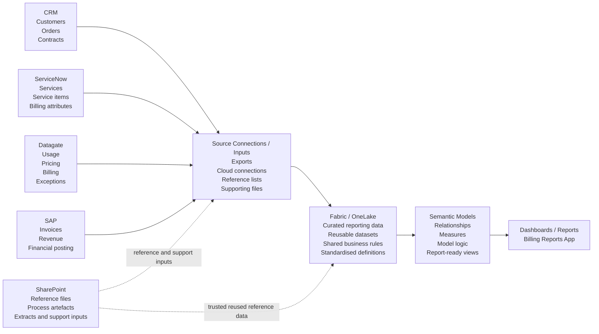

# Data Ingestion and Reporting Flow

## End-to-End Flow Objective

The purpose of this design is to improve how data moves from operational platforms into billing and exception reporting outputs. Instead of relying on fragmented report-level transformations, the architecture introduces a clearer flow from ingestion to reporting.

## End-to-End Reporting Pattern

The following diagram represents the semantic-centric reporting flow used in this project. It shows how upstream telecom business systems are first connected through an ingestion layer, then governed in Fabric / OneLake, and finally shaped into semantic models and reporting outputs.

This flow is important because it makes clear that billing and exception reporting is built through several layers of preparation and interpretation. Source systems contribute raw operational, billing, finance, and reference data. Fabric then acts as the governed layer where that information is standardised and prepared for reuse. Semantic models provide the business meaning and reporting structure before dashboards are finally consumed by users.

## Source Systems

The reporting environment brings together data from multiple enterprise platforms, including:

- CRM for customer, account, and commercial context
- ServiceNow for service and operational records
- Datagate for billing and usage-related billing data
- SAP for invoice and finance outputs
- SharePoint for extracts, mappings, and reference inputs
- other API or file-based feeds where needed

## Fabric Ingestion Layer

Microsoft Fabric is used as the entry point for ingesting and preparing source data. The architecture emphasises:

- Dataflow Gen2 for source-specific extraction and transformation
- Fabric pipelines for orchestration, refresh sequencing, and future workflow automation
- repeatable ingestion patterns across different source types

This helps separate ingestion logic from dashboard logic and reduces dependence on report-level data shaping.

## Lakehouse Layer

After ingestion and initial transformation, outputs are stored in a Lakehouse. The Lakehouse acts as:

- the central reusable storage layer
- the governed handoff point between ingestion and reporting
- the location where transformed outputs from different platforms can be aligned for downstream modelling

## Power BI Transformation and Modelling

Power BI connects to the curated Fabric layer rather than pulling all source complexity directly into reports. In this design, Power BI is used to:

- apply lighter reporting-focused transformations
- connect data from CRM, Datagate, ServiceNow, SAP, SharePoint, and related sources
- build fact and dimension relationships across those systems
- support billing and exception reporting through cleaner import-mode models

## Improvement Goal

The improvement goal is to create a more understandable and maintainable reporting flow in which ingestion, storage, transformation, and modelling each have a clearer place in the architecture. This makes billing and exception reporting easier to trace, easier to extend, and more reliable across multiple platforms.
